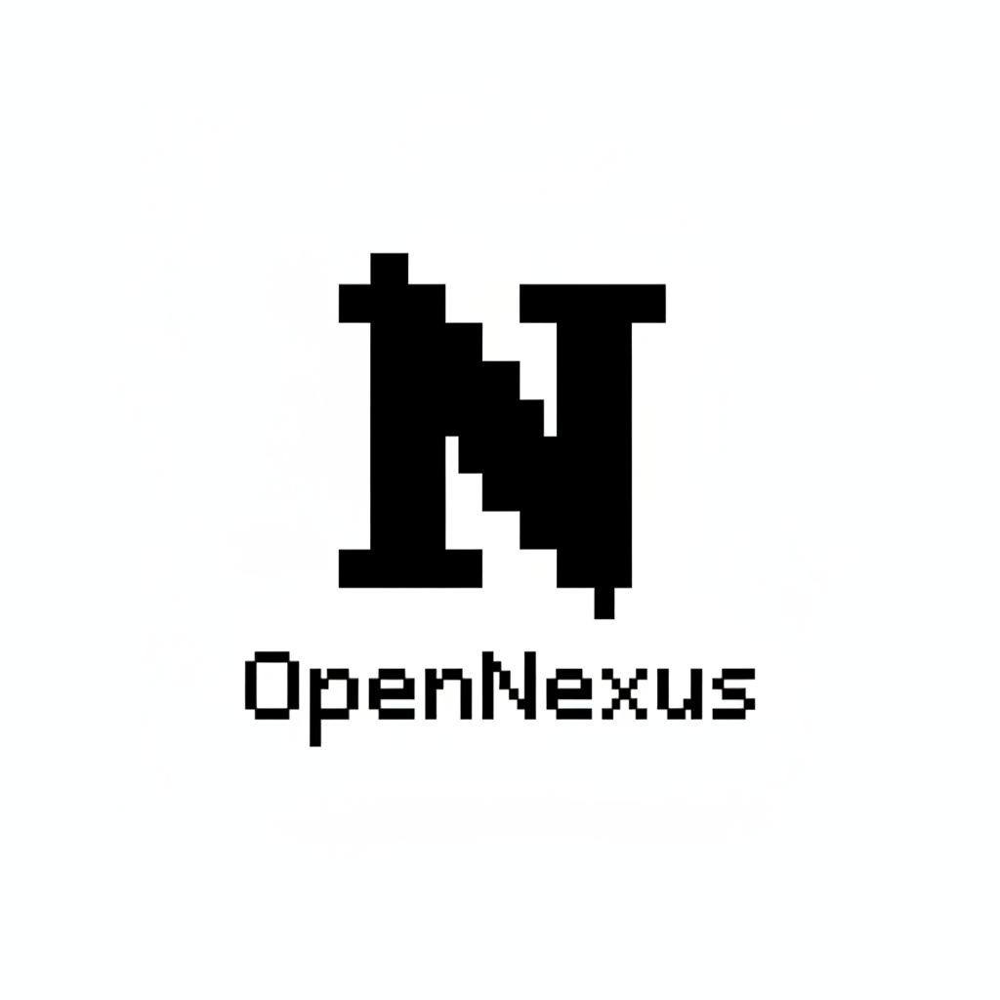
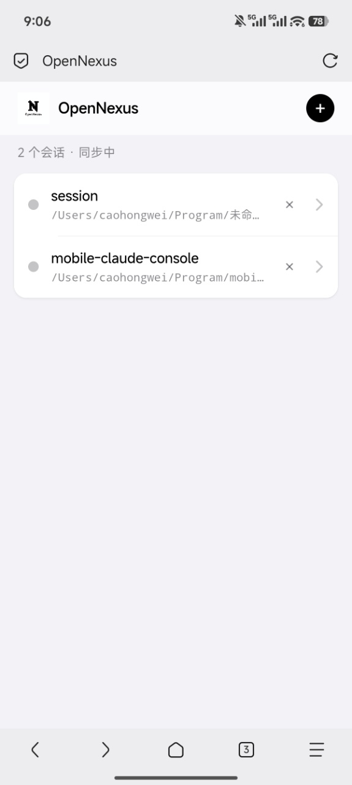
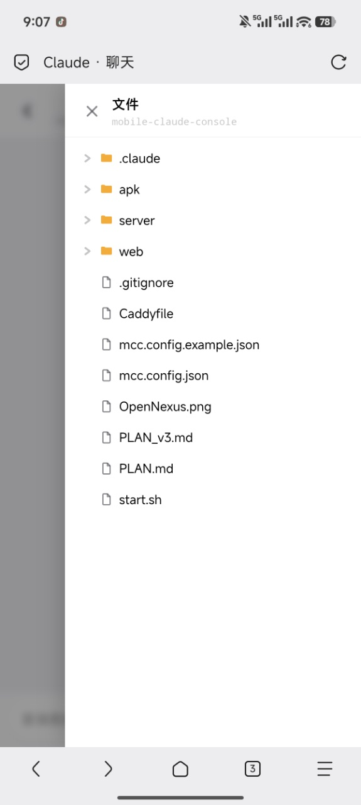
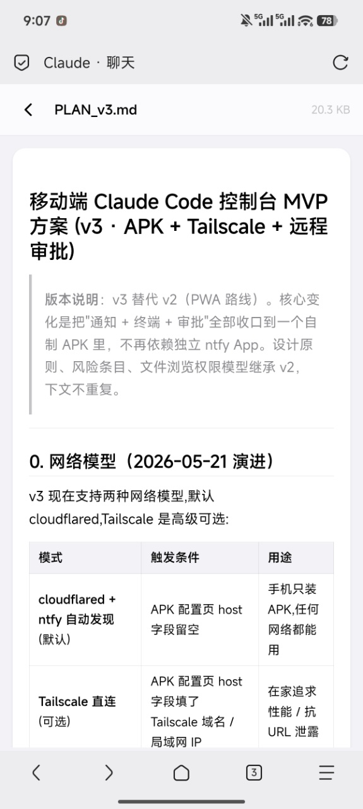
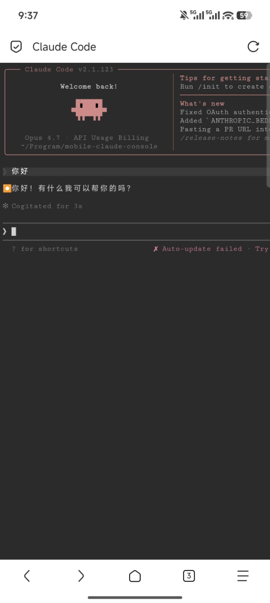

<div align="center">



# OpenNexus

**把家里那台开着 Claude Code 的 Mac，装进你的手机里。**

[](LICENSE)
[]()
[]()
[]()

</div>

---

## 一句话

OpenNexus 是一个**开源的「Claude Code 移动控制台」**：让你在通勤、咖啡馆、床上，用手机继续指挥家里 Mac 上正在跑的 Claude Code，看代码、改代码、审批危险操作，全程**不需要打开电脑**。

> Nexus = 节点 / 枢纽。
> 一台 Mac 是核心节点，一部手机、一台平板、一个临时分享的浏览器都是从这个节点辐射出去的「轻终端」。

## 解决了什么问题

| 痛点                                                         | 目前一般做法                     | OpenNexus 的解法                                             |
| ------------------------------------------------------------ | -------------------------------- | ------------------------------------------------------------ |
| 出门在外，Claude Code 在 Mac 上跑到一半，**需要回复 / 决策** | 跑回家、远程桌面、SSH+tmux 手敲  | 手机收到推送 → **点按钮直接「允许 / 拒绝」**（PreToolUse hook 阻塞 + 远程回填） |
| 想继续聊，**不能在手机上直接接着对话**                       | 没法做                           | 手机原生**聊天 UI**（iOS 风格气泡 + Markdown + 代码高亮 + 工具调用折叠） |
| 临时想让**别人帮忙看 / 接管**会话                            | 录屏、远程协助、贴日志           | 一键「分享」→ 生成 cloudflared 公网 URL（自带 ttyd 终端 + `--resume` 历史）→ 发给任何人 |
| 想**看 Mac 上某个文件**（py、md、图片、配置）                | scp / 截屏 / 复述                | APK 内**文件树抽屉** + 全屏预览（图片、Markdown、代码高亮、二进制下载） |
| 多个项目同时开多个会话，互不污染                             | 一个 tmux 里多个面板、命名容易乱 | 每个会话一个**独立 Claude 子进程**，按目录隔离，列表里清清楚楚 |
| 想内网用、想公网用、想离线用                                 | 选 1                             | 三种网络模式共存：**Tailscale 直连 / cloudflared 公网 / 局域网 IP**，配置二字段切换 |

## 它**不是**什么

- ❌ 不是 SaaS、不要订阅、不上传你的代码到任何第三方服务器。
- ❌ 不是 Claude Code 的 fork、不修改任何 Anthropic 的二进制，只是 hook + 协议层。
- ❌ 不替你写代码，只是把已经能跑的 Claude Code「延伸到手机上」。

## 截图

<div align="center">

|  会话列表                                                |  聊天 UI                                                 |  文件抽屉                                              |  文件预览                                                |
| -------------------------------------------------------- | -------------------------------------------------------- | ------------------------------------------------------ | -------------------------------------------------------- |
|  |  |  |  |

|  分享终端                                                  |  审批推送                                                  |  目录选择器                                              |
| ---------------------------------------------------------- | ---------------------------------------------------------- | -------------------------------------------------------- |
|  |  |  |

</div>

## 架构总览

```
┌────────────────────────────────────────────────────────────────┐
│  Android 手机 / 平板 / 临时浏览器                                │
│  ┌──────────────────────────────────────────────────────────┐ │
│  │ OpenNexus APK (Kotlin + Compose)                          │ │
│  │  · 会话 Tab(WebView ➜ chat.html)                          │ │
│  │  · 终端 Tab(WebView ➜ ttyd)                                │ │
│  │  · 文件 Tab(WebView ➜ files.html)                          │ │
│  │  · ForegroundService(ntfy 长连接 + 通知按钮)            │ │
│  └──────────────────────────────────────────────────────────┘ │
└──────────────┬────────────────────────────┬────────────────────┘
               │ Tailscale 直连              │ ntfy.sh/<topic>
               │ http://mac.ts.net:8080      │ (公网推送中转)
               ▼                            ▼
┌──────────────────────────────────────────────────────────────────┐
│  Mac 端                                                            │
│  ┌──────────────────────────────────────────────────────────┐   │
│  │ Caddy :8080  反向代理 + 静态                                  │   │
│  │  ├─ /api/*    → Bun :9999                                  │   │
│  │  ├─ /files/*  → Bun :9999                                  │   │
│  │  └─ /         → web/ 静态                                  │   │
│  └──────────────────────────────────────────────────────────┘   │
│  ┌──────────────────────────────────────────────────────────┐   │
│  │ Bun 状态服务 :9999                                            │   │
│  │  · 会话 CRUD（无 tmux，按目录建子进程）                       │   │
│  │  · 聊天 SSE（`claude -p --output-format stream-json --resume`）│  │
│  │  · 文件 API（按 session 限定根 + 防穿透）                     │   │
│  │  · 文件浏览 API（/api/fs/list 给 UI 选目录）              │   │
│  │  · 审批挂起 + 决策接收（hook 阻塞 + ntfy 推送回填）       │   │
│  │  · 临时分享（ttyd + tmux + cloudflared per share）           │   │
│  │  · /api/access（多入口统一发现）                          │   │
│  └──────────────────────────────────────────────────────────┘   │
│  ┌──────────────────────────────────────────────────────────┐   │
│  │ Claude Code + ~/.claude/settings.json hooks                  │   │
│  │  PreToolUse → permission-hook.sh → 阻塞等回填                 │   │
│  │  Notification / Stop → /api/event                            │   │
│  └──────────────────────────────────────────────────────────┘   │
└──────────────────────────────────────────────────────────────────┘
```

### 设计要点

- **聊天 vs 终端的双模型**：手机端**主用聊天**（`claude -p` 一次性请求 + `--resume` 接续 sessionId）。终端只在分享给别人时按需 spawn `tmux + ttyd + claude --resume`。本机用户不再需要常驻 tmux。
- **历史读 jsonl**：直接读 Claude 自己写的 `~/.claude/projects/<encoded-path>/<sid>.jsonl`，UI 重启不丢、不需要 Server 重复维护。
- **PreToolUse 远程审批**：hook 阻塞 + 推送 ntfy 带按钮 + 决策写信号文件回填，整链路 < 1 秒。
- **零白名单**：v3 起去掉 `projectRoots` 白名单，前端给一个**目录浏览选择器**（`/api/fs/list`），可拉任何你机器上能访问的绝对路径。
- **网络入口三选一**（按优先级展示给 APK）：Tailscale → cloudflared → localhost。Tailscale 是**纯 opt-in**：只读 `config.tailscaleHostname`，不 spawn CLI。

## 快速开始

### 0. 你需要

| 组件           | 说明                                                                                                     |
| -------------- | -------------------------------------------------------------------------------------------------------- |
| macOS          | Apple Silicon 或 Intel 都行                                                                              |
| Claude Code    | 已登录、`claude` CLI 在 PATH 里                                                            |
| 一个 ntfy topic | 自己 `openssl rand -hex 16` 生成一个长串，**这就是你的"私有推送频道密码"**                              |
| Android 手机    | Android 8+（API 26），用来装 APK                                                              |

可选：
- **Tailscale**（推荐）：装上后填 `tailscaleHostname`，全程 Mac 不需要任何公网入口
- **cloudflared**：装上后自动起 quick tunnel，给手机一个临时公网 URL

### 1. Mac 端 5 分钟搭起来

```bash
# 依赖
brew install caddy ttyd tmux oven-sh/bun/bun cloudflared
# 可选
brew install --cask tailscale

# 拉代码
git clone https://github.com/<你>/opennexus.git
cd opennexus

# 写配置
cp mcc.config.example.json mcc.config.json
$EDITOR mcc.config.json    # 至少填 ntfyTopic

# 起服务（Caddy + Bun + 可选 cloudflared）
./start.sh
```

启动后控制台会打印一组「访问入口」：

```
📡 访问路径:
  · tailscale  http://mac-mini.tailnet-xxxx.ts.net:8080/    推荐 · 内网低延迟
  · tunnel     https://<random>.trycloudflare.com           公网 · 任何网络可达
  · localhost  http://127.0.0.1:8080/                       仅本机
```

### 2. 装 APK

```bash
# Release 包（已编译，直接装）
adb install release/OpenNexus-v0.1.0-debug.apk

# 或自己编译（详见 docs/BUILD.md）
cd apk
gradle wrapper --gradle-version 8.10.2   # 仅首次
./gradlew assembleDebug
adb install app/build/outputs/apk/debug/app-debug.apk
```

> **没有 release apk？** 当前仓库还没把预编译 apk 提交上来（首次发布前需要在能联通 dl.google.com 的环境下手动跑一次 `./gradlew assembleDebug`，把产物拷到 `release/`）。详细步骤见 [docs/BUILD.md](docs/BUILD.md)。

首次启动 → 填 Mac 主机（Tailscale 域名 / 公网 URL / 局域网 IP）+ ntfy topic → 进会话列表。

### 3. 配置 Claude Code Hook（可选但强烈推荐）

把下面的内容**合并**到 `~/.claude/settings.json`：

```json
{
  "hooks": {
    "PreToolUse": [{
      "matcher": ".*",
      "hooks": [{
        "type": "command",
        "command": "/Users/<你>/Program/opennexus/.claude/permission-hook.sh",
        "timeout": 60
      }]
    }]
  }
}
```

之后所有 Bash / Edit / Write 工具调用都会发推送到你手机，**点「允许」才会执行**。

## 目录结构

```
opennexus/
├── README.md                  ← 本文件
├── PLAN.md / PLAN_v3.md       ← 设计演进历史
├── Caddyfile                  ← 反向代理配置
├── start.sh                   ← 一键启动
├── mcc.config.example.json    ← 配置模板
├── server/                    ← Bun 状态服务
│   ├── index.ts                 主入口 + 路由
│   ├── sessions.ts              会话 CRUD（无 tmux）
│   ├── chat.ts                  聊天 stream-json 桥
│   ├── files.ts                 文件浏览 API
│   ├── fs.ts                    目录浏览 API（选目录用）
│   ├── permissions.ts           审批挂起 + 决策
│   ├── share.ts                 临时分享 ttyd+cfd
│   ├── access.ts                多入口发现
│   ├── tunnel.ts                cloudflared 包装
│   ├── ntfy.ts                  推送客户端
│   └── config.ts                配置加载
├── web/                       ← 静态前端（手机 WebView 加载这里）
│   ├── index.html               会话列表
│   ├── chat.html                聊天界面 + 文件抽屉
│   └── files.html               文件浏览全屏
├── apk/                       ← Android 客户端（Kotlin + Compose）
│   ├── app/src/main/...
│   └── build.gradle.kts
├── release/                   ← 预编译 APK
├── assets/
│   ├── logo/logo.png
│   └── screenshots/*.png
└── docs/                      ← 扩展文档
```

## 演进路线

| 版本  | 状态      | 关键能力                                                                                                                |
| ----- | --------- | ----------------------------------------------------------------------------------------------------------------------- |
| v0.1  | ✅ 已发  | 聊天 UI / 文件预览 / 临时分享 / 目录选择器                                            |
| v0.2  | 🗓️ 开发中 | APK ntfy 长连接 + 通知按钮、iOS App（Bark 推送替代 ntfy） |
| v0.3  | 🗓️ 设计 | **Codex CLI 适配器**,**Open Code 适配器**                     |
| V0.4 | 🚧 计划   |                                                           |
| v0.5 | 🚧 计划   |                                                           |
| v0.6 | 🚧 计划   |                                                           |
| v0.7 | 🚧 计划   |                                                           |
| v0.8 | 🚧 计划   |                                                           |

## 设计哲学

1. **手机端只装一个 APK 解决所有事**：通知、终端、聊天、文件，不要逼用户在 ntfy app / SSH client / WebSSH / 文件管理器之间跳。
2. **Mac 端不需要任何域名 / 证书**：Tailscale 给免费 MagicDNS，cloudflared 给免费 https 子域，ntfy.sh 给免费推送。零成本上线。
3. **本地优先、可离线**：默认全本机，公网入口是 opt-in。你的代码永远不离开你的 Mac。
4. **会话 = 一个目录**：不抽象出"项目"概念，目录就是项目。`~/.claude/projects/<encoded>` 是天然的会话数据库。
5. **可被替换**：APK 是 WebView 壳，UI 全在 `web/`；服务端是 Bun 单进程；推送是 ntfy 协议。任何一层都可以换。

## 贡献

欢迎 PR 和 Issue

## License

MIT © OpenNexus Contributors
